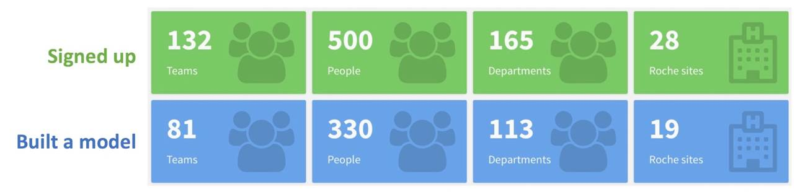
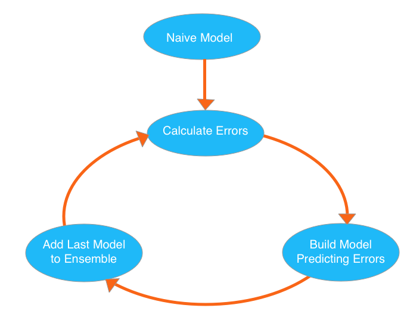
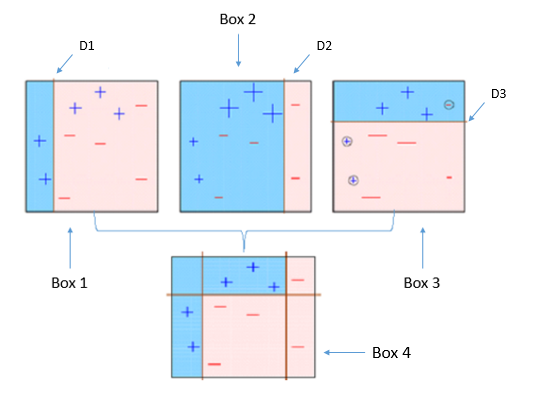
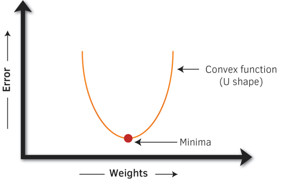
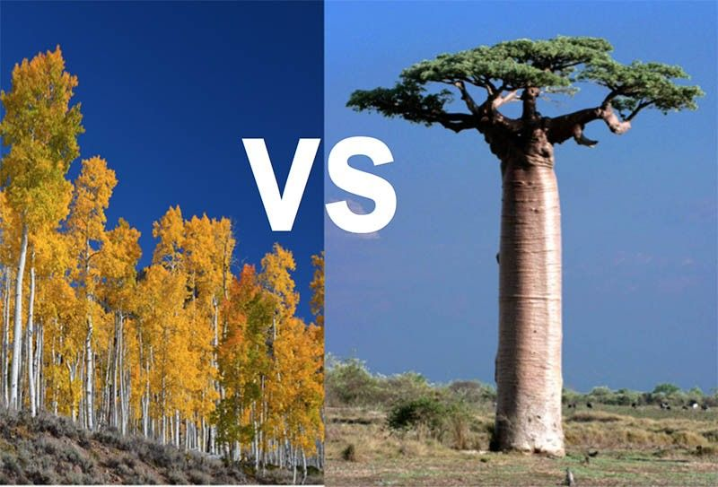

```{r setup, include=FALSE}
options(htmltools.dir.version = FALSE)
```

# Outline

- Introduction to XGBoost
  * Why XGBoost?
  * What is XGBoost? 
  * How does XGBoost work?

???

In this presentation, I am going to introduce XGBoost, one of the most popular machine learning algorithms these days.

The talk starts with "Introduction to XGBoost", followed by "How to use XGBoost in R". 

--

- XGBoost in R

--

- Further Readings

???

Last but not least, "Further Readings" provide you some online materials for further learning.

---

# Introduction (Why XGBoost?)

XGBoost has won the RAAD (Roche Advanced Analytics Data) challenge! 



.footnote[
For detail, please read ["Predict survival for cancer patients using real world data: simple model or advanced machine learning?" by Guiyuan Lei et al. at PSI conference 2018](https://guiyuanlei.github.io/rwd4prediction/)
]

???

Why do we want to learn XGBoost? XGBoost has won the RAAD (Roche Advanced Analytics Data) challenge among 81 teams across 19 Roche sites in early 2018!

The RAAD challenge was an internal competition within the Roche Group to predict the probability a patient will be alive at 1 year after treatment initiation, using Flatiron data.

Among 81 teams, different methods/models have been tried. The top 3 teams all used XGBoost algorithms!

For detail, please read ["Predict survival for cancer patients using real world data: simple model or advanced machine learning?" by Guiyuan Lei et al. at PSI conference 2018](https://guiyuanlei.github.io/rwd4prediction/)

---

# Introduction (Why XGBoost?) Cont.

- XGBoost is used in more than half of the winning solutions in machine learning challenges hosted at [Kaggle](https://www.kaggle.com) [(Incomplete list)](https://github.com/dmlc/xgboost/tree/master/demo#machine-learning-challenge-winning-solutions)

.pull-left[
 
]

.pull-right[
[Genentech launched competition "Cervical Cancer Screening"](https://www.kaggle.com/c/cervical-cancer-screening) Dec 2015 - Jan 2016. 

- [The first prize team used a lot of XGBoost and custom coded neural networks](http://blog.kaggle.com/2016/02/26/genentech-cervical-cancer-screening-winners-interview-1st-place-michael-giulio/). 

- [The second place also used XGBoost.](https://github.com/diefimov/genentech_2016/blob/master/README.pdf)
]
  
???

- XGBoost is used in more than half of the winning solutions in machine learning challenges hosted at [Kaggle](https://www.kaggle.com) [(Incomplete list)](https://github.com/dmlc/xgboost/tree/master/demo#machine-learning-challenge-winning-solutions)

- [Genentech launched competition "Cervical Cancer Screening: Help prevent cervical cancer by identifying at-risk populations"](https://www.kaggle.com/c/cervical-cancer-screening) in 2015. The first place and second place both used XGBoost, the AUC for test data is over 0.96!

--

- More and more real world data are available and learning Machine Learning methods would add benefit to statisticians

???

- Statistician will play important role in RWD area. [The winner team members from Genentech Kaggle competition (Cervical Cancer Screening) both have statisticial background](http://blog.kaggle.com/2016/02/26/genentech-cervical-cancer-screening-winners-interview-1st-place-michael-giulio/)

**More information**

- Kaggle (founded in 2010 with over 1 million members) is a platform for predictive modelling and analytics competitions in which statisticians and data miners compete to produce the best models for predicting and describing the datasets uploaded by companies and users.

- In Genentech competition ($100,000), you are to predict whether a patient receives regular cervical cancer screening (pap smear), given the medical records of over 3 million women in the United States. [Symphony Health Solutions](http://symphonyhealth.com/) provided 150GB de-identified health raw data. 

---

# What is XGBoost?


- XGBoost was short for "Extreme Gradient Boosting", created by Tianqi Chen, PhD Student, University of Washington in 2014. It is used for supervised Machine Learning problems.

--

- XGBoost can be used for 
  * classification
  * regression
  * ranking


  
???

XGBoost method can be used for classification, regression and ranking. It has tree model or liner model. 

The xgboost tree model is a set of classification and regression trees (CART). The picture shows one tree with inputs of age, gender and occupation. The object is to predict if one person likes computer games. 

The tree is split by age first, then for children split by gender. A boy got prediction score 2, a girl got score 0.1 and adults got score -1. The prediction score in each leaf is called "weights".

Pictures from ["Introduction to Boosted Trees"](https://xgboost.readthedocs.io/en/latest/model.html)

---

class: inverse, middle, center

# How does XGBoost Work?

---

# Boosting

.pull-left[

]

.pull-right[
- XGBoost belongs to a family of boosting algorithms that convert weak learners into strong learners.

- Boosting is an approach where new models are created that predict the residuals or errors of prior models and then added together to make the final prediction.
]


$$ \hat{y}_i^{(0)} = 0 $$
$$ \hat{y}_i^{(1)} = f_1(x_i) = \hat{y}_i^{(0)} + f_1(x_i) $$
$$ \hat{y}_i^{(2)} = f_1(x_i) + f_2(x_i) = \hat{y}_i^{(1)} + f_2(x_i) $$

$$ \cdots $$

???

XGBoost belongs to a family of boosting algorithms that convert weak learners into strong learners. Boosting is an approach where new models are created that predict the residuals or errors of prior models and then added together to make the final prediction.

As illustrated by the left picture, the learning process starts from naive model, then calculates error from current model, builds model for prediction errors, then adds the last model to previouse model, repeats the loop again and again. 

In mathematical way, in each round, the learning adds one function/model $f_k(x_i)$. For a boosted tree, the model consists the structure of a tree and weights (prediction score) in each leaf of the tree.

Note: $x_i$ is a vector with multiple features, $y_i$ is target variable, $i=1,2, \cdots$ for $n$ samples.

.footnote[
Picture from ["Machine Learning with XGBoost (in R)" by Rachael Tatman](https://www.kaggle.com/rtatman/machine-learning-with-xgboost-in-r/)
]

---

# Boosting for classification model

.pull-left[

.footnote[Picture from [Beginners Tutorial on XGBoost and Parameter Tuning in R](https://www.hackerearth.com/practice/machine-learning/machine-learning-algorithms/beginners-tutorial-on-xgboost-parameter-tuning-r/tutorial/)]
]

.pull-right[
- Four classifiers (in 4 boxes), shown left, are trying hard to classify + and - classes as homogeneously as possible. 

- The next model is built by giving a **higher weight** to misclassified points (see bigger size of + or -) by the previous model and tries to reduce it

- Box 4 is a weighted combination of the weak classifiers (boxes 1,2, and 3). 
]


???

Boosting is a sequential process; i.e., trees are grown using the information from a previously grown tree one after the other. This process slowly learns from data and tries to improve its prediction in subsequent iterations. Let's look at a classic classification example:

Four classifiers (in 4 boxes), shown left, are trying hard to classify + and - classes as homogeneously as possible. Let's understand this picture well.

1. Box 1: The first classifier creates a vertical line (split) at D1. It says anything to the left of D1 is + and anything to the right of D1 is -. However, this classifier misclassifies three + points.
1. Box 2: The next classifier says don't worry I will correct your mistakes. Therefore, it gives more weight to the three + misclassified points (see bigger size of +) and creates a vertical line at D2. Again it says, anything to right of D2 is - and left is +.  Still, it makes mistakes by incorrectly classifying three - points.
1. Box 3: The next classifier continues to bestow support. Again, it gives more weight to the three - misclassified points and creates a horizontal line at D3. Still, this classifier fails to classify the points (in circle) correctly.
1. Remember that each of these classifiers has a misclassification error associated with them.
1. Boxes 1,2, and 3 are weak classifiers. These classifiers will now be used to create a strong classifier Box 4.
1. Box 4: It is a weighted combination of the weak classifiers. As you can see, it does good job at classifying all the points correctly.

That's the basic idea behind boosting algorithms. The very next model capitalizes on the misclassification/error of previous model and tries to reduce it.

---

# Gradient Boosting

Gradient boosting uses a gradient descent algorithm to minimize the objective function when adding new models.

.pull-left[

]

.pull-right[
In the plot:

- The curve represents the objective function 

- x-axis "Weights" are the scores in the leaf in boosted trees.

- y-axis "Error" is the error/residual from a model

]


.footnote[
Picture from [Beginners Tutorial on XGBoost and Parameter Tuning in R](https://www.hackerearth.com/practice/machine-learning/machine-learning-algorithms/beginners-tutorial-on-xgboost-parameter-tuning-r/tutorial/)
]

???

Now we have basic understanding of "boosting", but what is "gradient boosting"? Or how does the learning process find the good model in each step? It is called gradient boosting because it uses a gradient descent algorithm to minimize the objective function when adding new models.

In the plot:

- The curve represents the objective function (training loss + regularization)
- x-axis "Weights" are the prediction scores in the leaf in boosted trees.
- y-axis "Error" is the error/residual from a model

The gradient boosting method calculates the partial derivative of the objective function (comprises a vector of weights/coefficients) to find the local minima of the objective function, which is convex in nature. 

The objective function consists of training loss and regularization term
  * The training loss measures how predictive our model is on training data. 
  * The regularization term controls the complexity of the model, which helps us to avoid overfitting. 
  
To know detail, I have added further reading material.

[Introduction to Boosted Trees](https://xgboost.readthedocs.io/en/latest/model.html)
["Introduction to Boosted Trees" bt Tianqi Chen](https://homes.cs.washington.edu/~tqchen/pdf/BoostedTree.pdf)

---

# XGBoost vs Random Forest




???

Random forests and boosted trees are not different in terms of model, the difference is how we train them:

- Random forest, an ensemble of trees that vote independently, each tree is build on bootstrap sample of observations and subset of features

- Gradient Boosting: create a collection of trees that optimize the cases that are badly predicted by previous trees


Picture from [eXtreme Gradient Boosting vs Random Forest [and the caret package for R] ](https://deepsense.ai/extreme-gradient-boosting-vs-random-forest-and-the-caret-package-for-r/)

[Trevor Hastie’s talk on Gradient Boosting Machine Learning (youtube)](https://www.youtube.com/watch?v=wPqtzj5VZus)

---

# Handle Missing Values

- XGBoost chooses a soft way to handle missing values. When using a feature with missing values to do splitting, XGBoost will assign a direction to the missing values instead of a numerical value. 
- Specifically, XGBoost guides all the data points with missing values to the left and right node respectively, then choose the direction with a higher gain with regard to the objective function.

---

class: inverse, middle, center

# XGBoost in R


???

Currently there are interfaces of XGBoost in C++, R, python, Julia, Java and Scala. Today I will only talk about how to use XGBoost in R.

---

# R packages

- caret

???

One of the R packages for XGBoost is caret, short for _C_lassification _A_nd _RE_gression _T_raining, it is a comprehensive framework for building machine learning models in R. It contains different methods such as SVM (Support Vector Machine), Random Forest and XGBoost.

[Caret Package – A Practical Guide to Machine Learning in R](https://www.machinelearningplus.com/machine-learning/caret-package/)

--

- xgboost

```{r eval=FALSE, tidy=FALSE}
install.packages('xgboost')
```

```{r warning=FALSE, tidy=FALSE}
library(xgboost)
```

???

Another R package is xgboost, by Tianqi Chen et al., the author of the XGBoost algorithm. 

Here are the R code to install and load the package.

---

# Mushroom example with R package xgboost

Identifying Mushrooms: Why it’s So Hard? 

.pull-left[


.footnote[Picture from [Poisonous Mushrooms vs. Edible Wild Mushrooms: A Warning](https://blog.uvahealth.com/2017/02/27/poisonous-mushrooms/)]
]

.pull-right[

You may think:

 - Poisonous mushrooms always have bright, flashy colors.

 - Snails, insects or other animals won’t eat poisonous mushrooms

 - Toxic mushrooms smell and taste horrible.

But those are not always true! 
]

???

I am going to use a mushrooms example to illustrate how to use xgboost package: how to load data, train model and examine model. The reason that I choose this example is the data is included in xgboost package. You can try the example by following the codes presented in the following several slides.

Poisonous mushrooms, like these amanita, can cause death. How to identify mushrooms are poisonous or not? You may think poisonous mushrooms always have bright, flashy colors; or snails, insects or thoer animals won't eat poisonous mushrooms; or toxic mushrooms smell and taste horrible. But those are not always true.

**Poisonous Mushrooms: Myths vs. Facts**

People pass along misinformation about how to distinguish edible mushrooms from poisonous species, like the following:

**Myth**: Poisonous mushrooms always have bright, flashy colors.

**Fact**: Toxic species can be pure white or plain brown.


**Myth**: Snails, insects or other animals won’t eat poisonous mushrooms.

**Fact**: Just because a mushroom doesn’t hurt another animal doesn’t mean it won’t hurt you.


**Myth**: Toxic mushrooms smell and taste horrible.

**Fact**: Some say toxic mushrooms actually taste very good.

---

# Load data

This data set records biological attributes of different mushroom species, and the target is to predict whether it is poisonous

--

```{r warning=FALSE, tidy=FALSE}
data(agaricus.train, package='xgboost')
data(agaricus.test, package='xgboost')
train <- agaricus.train
test <- agaricus.test
```

--

- `r nrow(train$data) + nrow(test$data)` mushrooms, `r round(nrow(train$data)/(nrow(train$data) + nrow(test$data))*100)`% mushrooms in training dataset, `r round(nrow(test$data)/(nrow(train$data) + nrow(test$data))*100)`% mushrooms in test dataset 
- 23 species of gilled mushrooms in the Agaricus and Lepiota Family
- 22 attributes/features including cap-shape, cap-surface, cap-color, odor, stalk-shape, stalk- root, population, habitat etc

???

The first step is to load data. I have to say almost always you will need to clean data, pre-process data and convert data. In this example, the data has been prepared to be ready for use.

- [Mushroom data is cited from UCI Machine Learning Repository. Bache and Lichman (2013).](https://archive.ics.uci.edu/ml/datasets/mushroom)

- 8124 mushrooms, 80% used to build model, 20% for test

- 23 species of gilled mushrooms in the Agaricus and Lepiota Family. Each species is identified as definitely edible, definitely poisonous, or of unknown edibility and not recommended. This latter class was combined with the poisonous one.

- 22 attributes
    1. cap-shape: bell=b,conical=c,convex=x,flat=f, knobbed=k,sunken=s 
    1. cap-surface: fibrous=f,grooves=g,scaly=y,smooth=s 
    1. cap-color: brown=n,buff=b,cinnamon=c,gray=g,green=r, pink=p,purple=u,red=e,white=w,yellow=y 
    1. bruises?: bruises=t,no=f 
    1. odor: almond=a,anise=l,creosote=c,fishy=y,foul=f, musty=m,none=n,pungent=p,spicy=s 
    1. gill-attachment: attached=a,descending=d,free=f,notched=n 
    1. gill-spacing: close=c,crowded=w,distant=d 
    1. gill-size: broad=b,narrow=n 
    1. gill-color: black=k,brown=n,buff=b,chocolate=h,gray=g, green=r,orange=o,pink=p,purple=u,red=e, white=w,yellow=y 
    1. stalk-shape: enlarging=e,tapering=t 
    1. stalk-root: bulbous=b,club=c,cup=u,equal=e, rhizomorphs=z,rooted=r,missing=? 
    1. stalk-surface-above-ring: fibrous=f,scaly=y,silky=k,smooth=s 
    1. stalk-surface-below-ring: fibrous=f,scaly=y,silky=k,smooth=s 
    1. stalk-color-above-ring: brown=n,buff=b,cinnamon=c,gray=g,orange=o, pink=p,red=e,white=w,yellow=y 
    1. stalk-color-below-ring: brown=n,buff=b,cinnamon=c,gray=g,orange=o, pink=p,red=e,white=w,yellow=y 
    1. veil-type: partial=p,universal=u 
    1. veil-color: brown=n,orange=o,white=w,yellow=y 
    1. ring-number: none=n,one=o,two=t 
    1. ring-type: cobwebby=c,evanescent=e,flaring=f,large=l, none=n,pendant=p,sheathing=s,zone=z 
    1. spore-print-color: black=k,brown=n,buff=b,chocolate=h,green=r, orange=o,purple=u,white=w,yellow=y 
    1. population: abundant=a,clustered=c,numerous=n, scattered=s,several=v,solitary=y 
    1. habitat: grasses=g,leaves=l,meadows=m,paths=p, urban=u,waste=w,woods=d

---

# Training our model

The simplest training command is as follows:

```{r eval=FALSE, tidy=FALSE}
model <- xgboost(data = train$data, label = train$label
                 , nrounds = 2 # number of decision trees
                 , objective = "binary:logistic" # binary classifier
                 )
```

???

The simplest training command is as follows. We use training dataset ("train" in the code) for building models. Each dataset is a list containing two things, *label* and *data*, *label* is the outcome of our dataset meaning it is the binary classification we will try to predict.

In the code: 

- *nrounds*: the number of decision trees in the final model

- *objective*: the training objective to use, where “binary:logistic” means a binary classifier

--

We can make prediction on the test data set easily:

```{r eval=FALSE, tidy=FALSE}
preds <- predict(model, test$data)
```

???

"test" is the test dataset.

---

# Tuning our model

> **"A good Cross Validation is half of success." **

--

```{r warning=FALSE, tidy=FALSE}
bst <- xgb.cv(data = train$data, label = train$label
              , nfold = 5 # cross validation
              , nrounds = 20, early.stop.round = 3 # early stopping
              , objective = "binary:logistic"
              , maximize = FALSE)
```

???

Tuning model is very important. I don't want to go into detail, just mention "Cross Validation". "A good CV is half of success", said [Shubin Dai](http://blog.kaggle.com/2018/05/07/profiling-top-kagglers-bestfitting-currently-1-in-the-world/), currently the #1 on Kaggle's Leaderboard

We use function xgb.cv() to perform cross validation. In the code:

- early.stop.round = 3 means if the performance is not getting better for 3 steps, then the program will stop
- maximize = FALSE means our goal is not to maximize the evaluation, where the default evaluation metric for binary classification is the classification error rate

We can see that even we ask the model to train 20 trees, it stopped after the performance is perfect.

---

# Model Inspection

```{r eval=FALSE, tidy=FALSE}
bst <- xgboost(data = train$data, label = train$label
               , max.depth = 2 # maximum depth of a tree
               , eta = 1 # control the learning rate
               , nthread = 2 # number of parallel threads
               , nround = 2 # number of decision trees
               , objective = "binary:logistic")

xgb.plot.tree(feature_names = agaricus.train$data@Dimnames[[2]]
              , model = bst)
```

???

The model used by xgboost is gradient boosting trees, therefore a model usually contains multiple tree models. We can plot the trees and visualize them. The function used is xgb.plot.tree().

---

# Model Inspection (plot)


```{r echo=FALSE, results='hide', warning=FALSE}
bst <- xgboost(data = train$data, label = train$label
               , max.depth = 2
               , eta = 1
               , nthread = 2
               , nround = 2
               , objective = "binary:logistic")
```

```{r echo=FALSE, fig.align='center', warning=FALSE}
xgb.plot.tree(feature_names = agaricus.train$data@Dimnames[[2]]
              , model = bst)
```

???

A typical ensemble of two trees looks like this:

In the tree: 

- **Cover** measures the relative quantity of observations concerned by a feature.

- **Gain** is the contribution from the selected feature.

If we have many trees, in xgboost, there is a function xgb.plot.multi.trees to ensemble several trees into a single one! 

---

# Feature Importance

```{r eval=FALSE, tidy=FALSE}
bst <- xgboost(data = train$data, label = train$label
               , max.depth = 2 # maximum depth of a tree
               , eta = 1 # control the learning rate
               , nthread = 2 # number of parallel threads
               , nround = 2 # number of decision trees
               , objective = "binary:logistic")

importance <- xgb.importance(agaricus.train$data@Dimnames[[2]]
                            , model = bst)

xgb.plot.importance(importance)
```

???

If the tree is too deep, or the number of features is large, then it is still gonna be difficult to find any useful patterns. One simplified way is to check feature importance instead. How do we define feature importance in xgboost?

In xgboost, each split tries to find the best feature and splitting point to optimize the objective. We can calculate the gain on each node, and it is the contribution from the selected feature. In the end we look into all the trees, and sum up all the contribution for each feature and treat it as the importance. If the number of features is large, we can also do a clustering on features before we make the plot. 

Here’s an example of the feature importance plot from the function xgb.plot.importance.

---

# Feature Importance (plot)

You can see that color is NOT the most important feature!

```{r echo=FALSE, results='hide', fig.align='center', warning=FALSE}
bst <- xgboost(data = train$data, label = train$label
               , max.depth = 2
               , eta = 1
               , nthread = 2
               , nround = 2
               , objective = "binary:logistic")
importance_matrix <- xgb.importance(agaricus.train$data@Dimnames[[2]]
                                    , model = bst)
xgb.plot.importance(importance_matrix)
```

???

You can see that color is NOT the most important feature! Instead Odor is the most important feature to tell if a ushroom is poisonous or not. 

odor: almond=a,anise=l,creosote=c,fishy=y,foul=f, musty=m,none=n,pungent=p,spicy=s

---

# Summary

We have talked about:

- What is XGBoost?
- How does XGBoost work?
- XGBoost in R

The mushroom example is a example with small data. XGBoost can manage huge dataset very efficiently. 

It is your turn to up for a real challenge!

---

# Further Readings

- [Beginners Tutorial on XGBoost and Parameter Tuning in R](https://www.hackerearth.com/practice/machine-learning/machine-learning-algorithms/beginners-tutorial-on-xgboost-parameter-tuning-r/tutorial/)

- [Machine Learning with XGBoost (in R)](https://www.kaggle.com/rtatman/machine-learning-with-xgboost-in-r/)

- [An Introduction to XGBoost R package](http://dmlc.ml/rstats/2016/03/10/xgboost.html)

- [A Gentle Introduction to XGBoost for Applied Machine Learning](https://machinelearningmastery.com/gentle-introduction-xgboost-applied-machine-learning/)

- ["Introduction to Boosted Trees" by Tianqi Chen](https://homes.cs.washington.edu/~tqchen/pdf/BoostedTree.pdf)

- [Awesome XGBoost, a curated list of examples, tutorials, blogs about XGBoost usecases](https://github.com/dmlc/xgboost/tree/master/demo)

- [Datasets on Kaggle](https://www.kaggle.com/datasets)

- [Kaggle Winners' Interviews](http://blog.kaggle.com/category/winners-interviews/)


???

- The "Machine Learning with XGBoost (in R)" has an example of preparing data.
- "Introduction to Boosted Trees" (by Tianqi Chen) helps you understand the math/theory behind XGBoost
- "Kaggle Winners' Interviews" shares experience from winners, there are some very inspiring stories. For example, how a new mum picked up machine learning skills and won a silver medal on maternity leave.

---

# Kaggle past solutions

- [A searchable and sortable compilation of Kaggle past solutions](https://github.com/EliotAndres/kaggle-past-solutions)
- http://www.chioka.in/kaggle-competition-solutions/
- [Kaggle winning code](http://shujianliu.com/kaggle-winning-code.html)
- [Most Popular Kaggle Competition Solutions](http://dataaspirant.com/2016/10/06/most-popular-kaggle-competition-solutions/)

---

class: inverse, middle, center

# Thanks!

guiyuanlei@gmail.com

https://github.com/guiyuanlei/xgboost/

